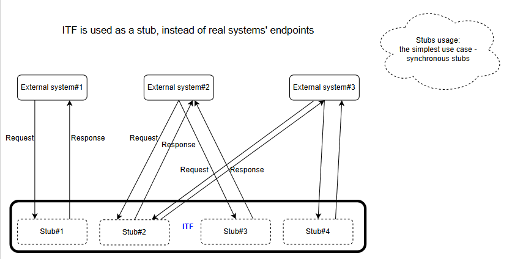
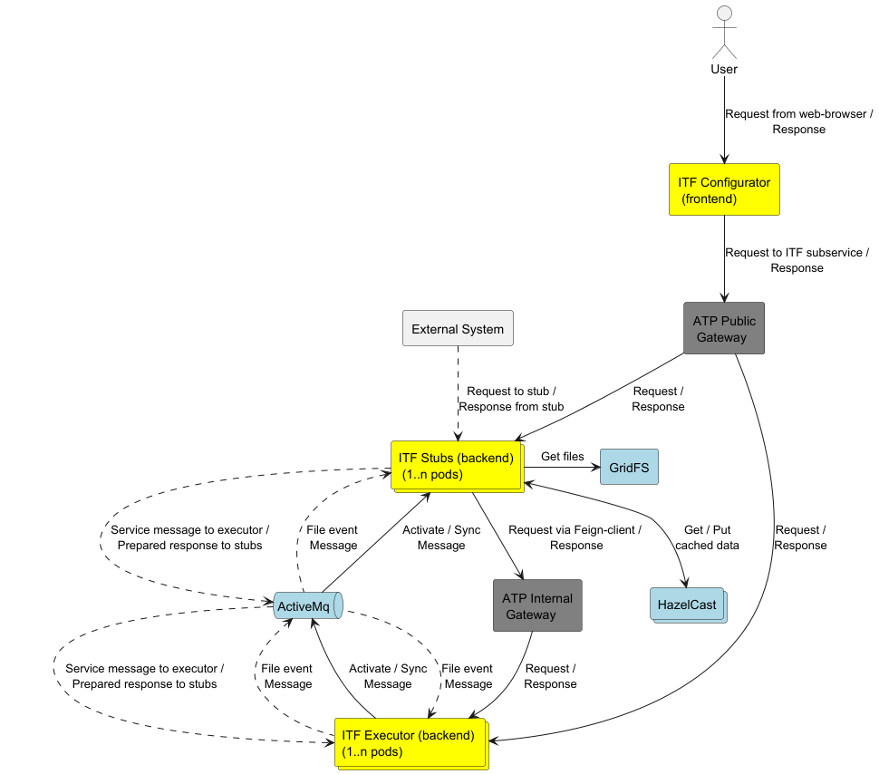

# Qubership Testing Platform ITF Stubs Service

**ITF Stubs Service** is a backend component `Integrations Testing Framework`

## Problem statement
When some complex application systems are integrated, they are on the different life cycle stages at the moment.

For example, some functionality of a system is under development, and/or entire system is under replacing with a new one.

Integrations of all rest systems with modified ones must be tested to ensure that functionality is not broken.

If testing process is started after all systems are fully developed, one need a lot of time to wait. So, life cycle duration is very big that entails losses.

ITF can be used instead of any side of integration process, so testing process can be started much earlier.

This information is described in more details below.

## Target audience
ITF is a tool set for QA/TA engineers testing integrations between application systems.

## Tool benefits
ITF allows to configure integration scenarios of various complexity: from the simplest stubs to dynamic call chains.

Just after a scenario is configured, it can be executed.

Execution results can be easily viewed and analysed.

Configuration and Execution results are stored in the inner database.

ITF can run on Windows VMs or Unix servers with relatively low resources.

ITF is based on the free-licensed software only.

## What is ITF?
**ITF** = **Integrations Testing Framework** = **A toolset for systems' integrations testing**, where:
* **System** is an arbitrary application system or a module of an application system,
* Systems **Integration** is a process of systems interaction via sending/receiving some messages, and performing actions based on the messages content,

## Where is ITF?
Suppose a real "network of systems":
* Each system interacts with some others. Some systems (or their modules) can be under construction, or planned to be replaced with new ones,
* So, at the moment, some functionality can be absent (a system/module hasn't developed yet),
* But "network of systems" must be tested despite some systems are not ready!

In such situation, **each real system can be temporary (for testing purposes) replaced with ITF.** And/or each operation can be replaced with operation which is managed by ITF.

The functionality of the real system being replaced is emulated by ITF via configuring callchains, templates, operations and some other objects.

After it, ITF becomes a participant of the "network of systems", instead of the real system.

It could really decrease a duration of the development process due to bugs are found earlier than without ITF.

### To support the testing, ITF provides the following functionality:
1. To configure tests
2. To execute tests
3. To monitor execution results

Some details are provided below:

## ITF usage: main use cases
The 1st use case is when an interaction is initiated by an external system, not by ITF.

So, ITF is used as a stub, serving requests instead of some (not implemented yet or not installed) external systems or parts of systems.

The 2nd use case is when an interaction is initiated by ITF.

Variants, how ITF actions are invoked, include:

1. From ITF web UI
2. Via ITF REST API (From Jenkins job or Postman)
3. From ATP2 testcase via ITF action or executor-ITF action

## To configure tests
1. ITF provides Web user interface:
   * to view configuration objects and their relationships,
   * to add, modify, delete, copy/move/paste, reorder configuration objects,
   * to debug a behavior of some complex objects,
2. ITF Web user interface is fully functional in the Chrome Web browser
3. Configuration objects are stored in the inner database
   * PostgreSQL v.14.3+ are currently supported
4. Just after storing, configuration objects can be used while tests execution

## To execute tests
1. ITF provides Web user interface:
   * to set execution options and then to run a **callchain**
   * to pause/resume a running callchain
   * to activate/deactivate transport triggers
   * to re-execute failed callchain starting from some step selected
2. Also, ITF provides other ways to execute tests:
   * Callchain can be executed from NTT/Executor via **actions**
   * REST API is provided to run a callchain and check execution status

### To monitor execution results
1. ITF provides Web user interface:
   * to view **contexts** table (**context** is an object accumulating callchain execution information),
   * to view a context details,
2. ITF reports (sends execution information) into other tools/systems:
   * RAM2

## High Level architecture

# Documentation:

* ### [Installation Guide](./docs/installation-guide.md)
* ### [Startup Guide](./docs/startup-guide.md)
* ### [User Guide](./docs/user-guide.md)

